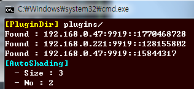

자동 스케일 아웃
====
```
자동 스케일 아웃은 완전하지 않은 기능입니다. 다음 버전에서 실 사용이 가능하도록 다양한 옵션들을 준비할 예정입니다.
```
버전 __v.1.4.0__ 부터 자동 스케일 아웃(의 프로토타입)을 지원합니다.<br>
수동으로 `shardNo`와 `shardSize` 값을 지정하지 않아도, 네트워크에서 자동으로 노드들을 검색해 값을 설정합니다.

사용하기
----
`sharding_options.json` 파일에 `size` 항목을 __0__으로 지정합니다.<br>
이 경우 `no` 필드는 무시됩니다.
```json
{
  "no" : 2,
  "size" : 0,
  "enable" : true
}
```
이후 봇을 실행하면 자동으로 디스커버리 시퀸스를 실행하며, 네트워크상의 다른 봇 노드를 검색합니다.<br>

<br>
<br>
<br>
