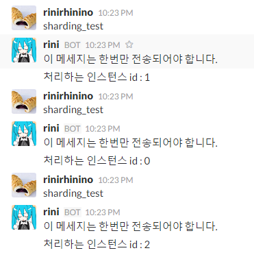

수평적 스케일 아웃
====
<br><br>

__sharding_option.json__
```json
{
    "no" : 0,
    "size" : 3,
    "enable" : true
}
```

<br><br>
__script.csx__
```cs
[Subscribe("sharding_test")]
public void OnShard(Message msg) {
    if (Sharding.isEnabled == false) {
        Slack.SendMessage(msg.channel, "샤딩 안켜짐.");
        return;
    } 
    
    Slack.SendMessage(msg.channel, "이 메세지는 한번만 전송되어야 합니다.");
    Slack.SendMessage(msg.channel, "처리하는 인스턴스 id : " + Sharding.no.ToString());
}
```

Presence API
----
```cs
Sharding.QueryPresences((now, max) => {
    // now : 현재 온라인인 인스턴스 수
    // max : 샤드 사이즈
});
```

ShardNo Masking
----
`Bootstrap`, `Schedule`은 특정 인스턴스에서만 실행되도록 마스킹 할 수 있습니다.<br>
(이 기능은 주기적으로 `QueryPresences`등을 돌릴 때 모든 노드에서 다돌아가면 정신없으니까 용도임
```cs
[ShadNo(1)]
[Bootstrap]
public void OnBootstrap() {
    // 이 코드는 1번 인스턴스에서만 실행됩니다.
}
```

명령줄 인수
----
샤드 옵션은 명령줄 인수로 컨트롤할 수 있습니다.<br>
이 값들은 파일로 지정한 설정보다 우선시됩니다. 자세한 사항은 아래 가이드들을 참고해주세요.
<br>
__[CmdArgs](https://github.com/pjc0247/Slacker/blob/master/doc/cmd_options.md)__<br>
__[Spawner](https://github.com/pjc0247/Slacker/blob/master/doc/adv/spawner.md)__<br>

자동 스케일 아웃
----
https://github.com/pjc0247/Slacker/blob/master/doc/adv/auto_sharding.md
