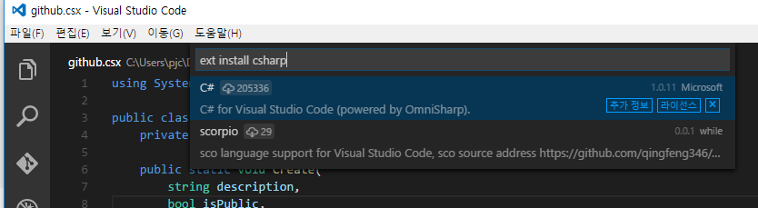

VS Code에서 에디팅하기
-----

[VS Code](https://code.visualstudio.com/)를 이용하여 `.csx` 파일을 편집할 수 있습니다.<br>
<br>
초기 상태의 VS Code는 C# 언어팩을 포함하고 있지 않습니다.<br>
`Ctrl + P` 키를 눌러 아래 명령어를 입력해주세요.
```
ext install csharp
```
<br>

링크
----
* [VS Code](https://code.visualstudio.com/)
* [VS Code C# Language Extension](https://marketplace.visualstudio.com/items?itemName=ms-vscode.csharp)
