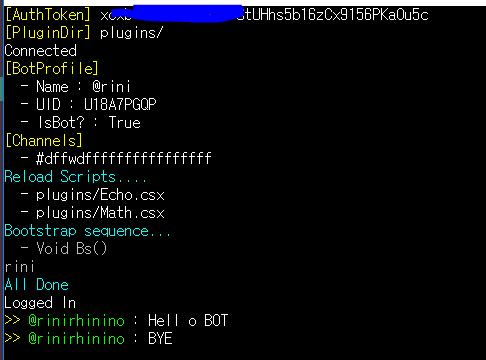

Slacker
====


Make Your OWN Bot.<br>
[Download](https://github.com/pjc0247/Slacker/releases)<br>
<br>
<sub>How-To-Guide : [English](guide_en.md)</sub><br>
<sub>Documentation : [Korean](doc)</sub>

Screenshot
----


토큰 가져오기
----
__https://api.slack.com/docs/oauth-test-tokens__
<br>
봇 디렉토리에 `token` 파일을 만들고 가져온 토큰을 넣고 저장합니다.<br>
<br>
혹은 봇 토큰을 사용하여도 됩니다.<br>
봇 토큰 생성은 [Slack 가이드](https://api.slack.com/bot-users)의 __Custom bot users__ 항목을 참조해 주세요.

명령어 추가하기
----
`plugins/` 폴더 아래에 `.csx` 파일을 생성한 후 아래와 같이 입력합니다.
```cs
using System;
using Slacker.Exports;

[Subscribe("안녕")]
public void OnHello(Message msg) {
  msg.Reply("안녕 " + msg.sender);
  
  // 또는,,
  // Slack.SendMessage(msg.channel, "안녕 " + msg.sender);
}
```

이후 `.csx` 파일을 수정하면 봇이 자동으로 변경사항을 재 로드합니다.

이미지 전송하기
----
```cs
[Subscribe("이미지")]
public void OnImg(Message msg) {
  var imageURL = "https://github.com/pjc0247/Slacker/raw/master/slack.png";
  
  msg.Reply(imageURL, title: "이미지 타이틀");
  
  // 이미지 타이틀 값은 옵션이므로 지정하지 않을 수 있습니다.
  // msg.Reply(imageURL);
}
```

메세지 수신하기 - 고급
----
__파일 수신하기__
```cs
// MessageType을 File로 지정
// 두번째 파라미터는 mime_type에 대한 필터입니다. (정규식)
// 만약 mime_type을 지정하지 않을 경우 모든 파일을 수신합니다.
[Subscribe(MessageType.File, mimeType: "image/*")]
public void OnReceiveImage(Message msg){
  // 수신한 파일의 정보를 가져옵니다.
  // https://api.slack.com/types/file
  var fileInfo = msg.file;
}
```
또는 `mimeType`이외에 다른 조건으로 필터를 만들 수 있습니다.
```cs
// 파일 이름으로 필터링
[Subscribe(MessageType.File, name: "*.rb")]

// Slack 파일 타입으로 필터링
// https://api.slack.com/types/file
[Subscribe(MessageType.File, fileType: "cpp")]
```

__캡처 사용하기__
```cs
// 정규식 캡처
[Subscribe("^따라해\\s(.+)$")]
public void OnEcho(Message msg){
  msg.Reply(msg.matchData.Groups[1].Value);
}
```

Message 구조체
----
```cs
public class Message {
  public string sender { get; set; }
  public string channel { get; set; }
  public string message { get; set; }
  
  // System.Text.RegularExpressions
  public Match matchData { get; set; }
}
```

부트스트랩
----
__부트스트랩 함수 추가하기__
```cs
[Bootstrap]
public void OnBootstrap() {
  // 이 함수는 스크립트 재 로드시에 실행됩니다.	
}
```
__설정 변경하기__
```cs
[Bootstrap]
public void OnBootstrap() {
  // STDOUT 로깅 설정
  Config.logMessage = true; // 봇이 수신한 메세지를 출력합니다.
  Config.logTrace = true; // 디버그 정보를 출력합니다.
                          // 이 정보는 정규식 매칭 결과 등을 포함합니다.
                          
  // 메세지 설정
  Config.ignoreBotMessage = true; // 봇이 보낸 메세지를 무시합니다.
}
```

Slack API
----
__내 프로필 가져오기__
```cs
var me = Slack.me;

string id = me.id;
string name = me.name;
bool isBot = me.isBot;
string email = me.email;
```

__메세지 보내기__
```cs
Slack.SendMessage("CHANNEL_NAME", "MESSAGE");
```

__상태 변경하기__
```cs
Slack.SetActive();
Slack.SetAway();
```

__채널__
```cs
var joinned = Slack.joinnedChannels;

var all = Slack.channels;
```

스케일 아웃
----
__Slacker__는 수평 스케일 아웃을 지원합니다.<br>
자세한 내용은 __doc__의 [샤딩](doc/shading.md) 참조

Heroku에 디플로이
----
https://github.com/pjc0247/slacker_buildpack<br>
위 링크의 빌드팩과 가이드를 이용하면 __Heroku__에 봇을 무임승차 시킬 수 있습니다.

코멘트
----
__Slacker__는 오픈 소스 프로젝트가 아닙니다. 하지만 기능 추가 등의 요청사항이 있을 경우 언제든지 알려주시기 바랍니다.
